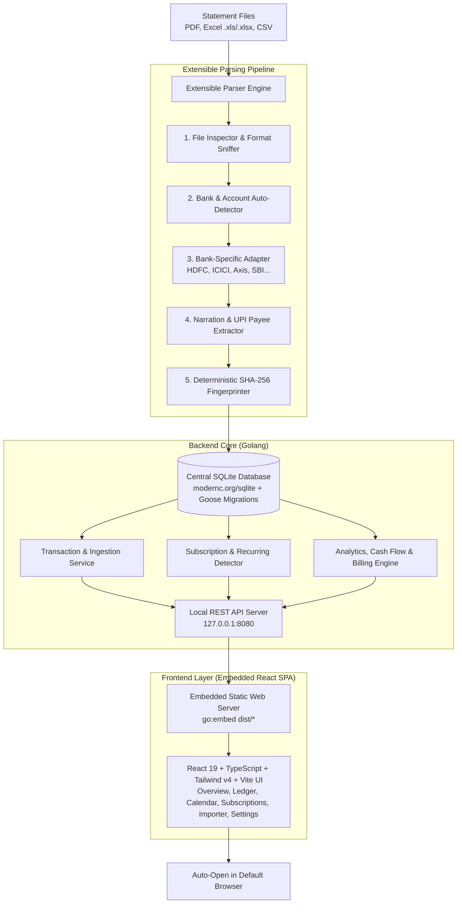

# 🇮🇳 LocalFinance — Product Specification & Roadmap

> **LocalFinance** is a privacy-first, 100% offline, local personal finance intelligence application tailored specifically for the Indian banking and credit card ecosystem. Distributed as a single self-contained executable with an embedded React frontend and an embedded pure-Go SQLite database.

---

## 🧭 Vision & Core Principles

1. **Zero Cloud / 100% Local**: No external telemetry, no remote servers, no third-party account aggregators, no cloud sync, and no SMS scraping. All user data lives exclusively on the local machine in an accessible SQLite database (`local_finance.db` or `~/.localfinance/local_finance.db`).
2. **Single-Binary Portability**: Compiled Go backend with the production React single-page app bundled via `go:embed`. Cross-platform across macOS (Intel/ARM64), Windows (`.exe`), and Linux with zero runtime dependencies and zero CGO (`CGO_ENABLED=0`).
3. **Extensible Parser Engine**: Modular bank adapter architecture with automatic format sniffing and confidence scoring (HDFC, ICICI, Axis, SBI, etc.) supporting PDF (password-decrypted), Excel (OpenXML `.xlsx` and legacy BIFF8/HTML `.xls`), and CSV.
4. **Indian Financial Ecosystem First**: Native regex engines for UPI VPAs, merchant IDs, POS terminal dumps, IMPS/NEFT/RTGS UTR numbers, credit card billing cycles, cashback/rewards tracking, and e-mandates.

---

## 🏗️ System Architecture



---

## 🗄️ Database Architecture & Migrations

SQLite schema migrations are managed using **Goose in embedded mode** (`github.com/pressly/goose/v3`) via Go `embed.FS`.

```
internal/db/migrations/
├── 00001_initial_schema.sql             # Core tables: accounts, statement_imports, transactions, categories, rules
├── 00002_enhance_central_schema.sql     # Customer ID, IFSC, card flags, transfer markers, currency
├── 00003_credit_card_enrichment.sql     # Card network, variant, merchant category, cashbacks, reward points, bills
├── 00004_subscriptions.sql             # Recurring subscriptions, e-mandates, billing days & renewal forecasts
├── 00005_card_reward_engine.sql         # Card parameters, fee waiver targets, billing cycles & reward match rules
├── 00006_category_budgets.sql           # Category monthly budgets, limits, and pacing targets
└── 00007_transfer_reconciliation.sql    # Transfer peer links, match reasons, and net offset amounts
```

---

## ✅ Completed Features Ledger (v1.0 Ready)

### 1. Ingestion Engine & Bank Statement Parsers
- [x] **Generic Extensible Parser Registry**: Modular `StatementParser` interface with auto-sniffing and confidence scoring.
- [x] **HDFC Savings & Current Account (PDF)**: Extracts debits, credits, UPI narrations, cheq/ref numbers, opening/closing balance, and password decryption.
- [x] **HDFC Savings & Current Account (Excel .xls / .xlsx)**: Handles legacy BIFF8 and HTML table exports.
- [x] **HDFC Savings Account (CSV)**: Standard CSV table extractor with BOM stripping.
- [x] **HDFC Credit Cards (PDF & CSV)**:
  - HDFC Regalia / Diners Club Credit Cards.
  - HDFC Swiggy Credit Card.
  - HDFC RuPay UPI Credit Card.
- [x] **ICICI Bank Credit Card (PDF)**: Amazon Pay ICICI statements with itemized spends and reward tracking.
- [x] **Axis Bank Credit Card (PDF)**: Flipkart Axis Credit Card with cashback summaries and EMI schedules.
- [x] **Generic CSV & Delimiter Sniffing Helper**: Auto-detects delimiters (comma, semicolon, tab), BOM headers, and column mappings for statement extractors.
- [x] **Multi-File Batch Upload with Preview Modal**: Upload multiple statements simultaneously with an in-memory parsed table preview dialog before committing to SQLite.
- [x] **Password Protected PDF Decryption**: In-memory decryption for password-protected PDF statements using AES/RC4 stream decryption.

### 2. Narration Intelligence & Transaction Processing
- [x] **Indian UPI Narration Cleaner**: Resolves `UPI/DR/...`, `UPI/CR/...`, VPA handles (`@okhdfcbank`, `@icici`, `@paytm`), merchant IDs, and app signatures (GPay, PhonePe, Paytm, Cred).
- [x] **POS & Card Swipe Cleaner**: Cleans noisy terminal dumps (e.g. `POS 40124300 SWIGGY BANGALORE IN` &rarr; `Swiggy`).
- [x] **NetBanking / IMPS / NEFT / RTGS**: Normalizes beneficiary names and 12-digit UTR identifiers.
- [x] **Deterministic SHA-256 Deduplication**: Idempotent upserts (`SHA256(account_id|date|amount|narration|ref_no|type)`) prevent double-counting when uploading overlapping statement cycles.
- [x] **Strict Preservation of User Customizations**: Category overrides, manual tags, and custom notes are strictly preserved during re-imports.

### 3. Financial Intelligence & Overview Dashboard (`/`)
- [x] **KPI Summary Ribbon**: Total Bank Liquidity (Savings/Current), Total Credit Card Outstanding Dues, Sanctioned Credit Limit, Credit Utilization Rate (%), Total Cashback Earned, and Reward Points Balance.
- [x] **Active Credit Card Bills Card**: Upcoming payment due dates, total due amount, minimum due, and bill status.
- [x] **Spend by Category Donut Chart**: Visual distribution of monthly expenditures.
- [x] **Cash Flow Bar Chart**: Inflow (Credits) vs Outflow (Debits) monthly trends.
- [x] **Top Payees / Merchants**: Highest spend recipients with total volume and order counts.
- [x] **Linked Accounts Summary**: Savings accounts, current accounts, and credit cards with masked account numbers.

### 4. Spending Calendar View (`/calendar`)
- [x] **Interactive 7-Day Monthly Heat-Map Grid**: Day-by-day spend totals, credit tags, active source pills, and intensity background tints.
- [x] **Month Intelligence Ribbon**: Monthly Outflow, Monthly Inflow, Daily Average Outflow, and Peak Spending Day highlight.
- [x] **Payment Source Breakdown**: Per-card/account spend and percentage share bars (Swiggy Card, Amazon Pay, Regalia, RuPay, Savings).
- [x] **Day Transaction Inspector Modal**: Complete day transactions table with search filter, payee names, raw narrations, and payment modes.

### 5. Transactions Ledger (`/transactions`)
- [x] **TanStack Table Engine**: High-performance sorting, pagination, and search.
- [x] **Time Window Filter Bar**: Quick-switch presets for:
  - 🌐 `All Time`
  - 📅 `Today`
  - ⏪ `Yesterday`
  - 📆 `This Week`
  - 🗓️ `This Month`
  - 📈 `This Year`
  - 🛠️ `Custom Range` (HTML5 Date Pickers `From: YYYY-MM-DD` to `To: YYYY-MM-DD`).
- [x] **Multi-Dimensional Filters**: Search query, Account/Card selector, Category selector, Transaction type (Debits vs Credits).
- [x] **Transaction Details Inspector**: Modal displaying raw narrations, UPI VPAs, card last 4, merchant categories, cashback, and UTR reference numbers.

### 6. Recurring Subscriptions & EMI Tracker (`/subscriptions`)
- [x] **Multi-Tier Detection Engine**:
  - **UPI AutoPay & e-Mandates**: Sniffs `AUTOPAY`, `MANDATEEXECUTE`, and `EXECUTIONTEST`.
  - **Known Merchant Catalog**: Netflix, YouTube Premium, Apple Media/iCloud, Spotify, Amazon Prime, Google One, ChatGPT, GitHub, Disney+ Hotstar, SonyLIV, Airtel, JioFiber, ACT Fibernet, Tata Play, Cult.fit.
  - **Loan & Card EMIs**: Captures `EMI PRINCIPAL`, `OFFUS EMI`, and NACH auto-debits.
  - **Statistical Cadence Sniffer**: Analyzes recurring payees with 28–33 day intervals and consistent amounts for uncatalogued custom merchants.
- [x] **Monthly Outflow & Burn Rate Ribbon**: Monthly recurring burn rate (`₹/mo`), annual projected commitment (`₹/yr`), active services count, and next due date countdown badge.
- [x] **Upcoming Renewal Timeline**: Chronological schedule with countdown badges (`Due today`, `In 2 days`, `In 14 days`).
- [x] **Category Filter Tabs**: Grouped views for *OTT & Media*, *Cloud & Tech*, *Utilities & Telecom*, and *Loans & EMIs*.
- [x] **Interactive Controls**: 1-Click "Scan Ledger", "Add Custom Subscription" modal, Pause/Resume toggles, Edit, Delete, and automatic price hike warnings.

### 7. Settings & Configuration Center (`/settings`)
- [x] **General & Preferences**: Theme Switcher (Light / Dark / System), Indian currency formatting specs, and Privacy guarantee.
- [x] **Categories & Rules**: Spending taxonomy manager & prioritized auto-tagging match rules.
- [x] **Bank Parsers**: Registry status of all parsers, supported extensions, and password decryption guide.
- [x] **Data & Storage Management**:
  - Active SQLite database location with one-click **Copy Path**.
  - Live storage statistics (file size on disk, WAL mode status, last modified).
  - Standalone SQLite backup download (`.db` snapshot with `PRAGMA wal_checkpoint`).
  - Clean CSV transaction ledger export.
  - Complete JSON dump export.
  - Database Restore (`.db` / `.sqlite`) with safety validation and automated `.bak` archiving.
  - Danger Zone database reset with safe confirmation dialog.

### 8. Credit Card Reward & Best-Card Recommendation Engine (`/cards`)
- [x] **Interactive Best-Card Recommender**: Select or search any merchant (Swiggy, Amazon, Flipkart, Blinkit, Uber, Petrol, Utilities, Flights) to find which card yields the highest reward rate (e.g. 10% vs 5% vs 1.5%), expected earnings, and reward terms.
- [x] **50-Day Interest-Free Grace Period Optimizer**: Visual timeline and countdown calculating exact remaining interest-free runway for purchases made today, highlighting the best card to swipe today.
- [x] **Annual Fee Waiver Milestone Tracker**: Tracks year-to-date card spend against annual spend targets with visual progress bars and projected fee savings.
- [x] **Card Portfolio & Custom Reward Rules Manager**: Manage billing cycle statement days, payment due days, annual fees, credit limits, network variants, and custom merchant reward rules.

### 9. Category Budgeting & Overspend Warning System (`/budget`)
- [x] **Monthly Spending Limits**: Set custom monthly targets per category (e.g. Dining: `₹12,000`, Shopping: `₹15,000`, Fuel: `₹6,000`, Groceries: `₹10,000`) with quick preset limit buttons.
- [x] **Visual Pacing Bars**: Progress bars dynamically transitioning from Green &rarr; Amber &rarr; Red comparing percentage spend against month progress calendar pins.
- [x] **Daily Recommended Allowance**: Live calculation of safe daily spending runway for the remaining days of the month (e.g. `₹340 / day remaining`).
- [x] **Overspend & Pacing Alerts**: High-visibility warning banners and badges when categories reach 80% warning threshold or exceed 100% limit.
- [x] **Month-by-Month Budget History**: Browse and set past and future month spending limits.

### 10. Smart CC Bill Payment & Transfer Reconciler (`/reconcile`)
- [x] **Cross-Account Transfer Auto-Pairing**: Heuristic engine matches bank account debits (Cred, BBPS, IMPS, NetBanking, Autodebit) with card credits within 4 days and ₹1 delta, marking `is_transfer = 1` and linking `transfer_peer_id`.
- [x] **Double-Counting Spend Protection**: Prevents credit card bill payment outflows from inflating monthly expense totals while preserving individual card ledger purchases.
- [x] **UPI Lite & Wallet Auto-Exclusion**: Detects wallet loads and UPI Lite top-ups, marking `is_excluded = 1` with 1-click inclusion/exclusion toggles.
- [x] **Interactive Reconciler UI**: 3-tab workbench featuring Candidate Pairs (with Match Confidence % and 1-Click "Confirm & Link"), Linked Transfers, and Excluded Wallet Loads.

### 11. Merchant & Payee Intelligence Deep-Dive (`/merchants`)
- [x] **Dedicated Merchant Directory**: Aggregated list of all tracked payees with search, category filtering, and sorting (by Highest Spend, Most Orders, Highest AOV, Most Recent).
- [x] **Merchant Profile Deep-Dive**: Modal view with lifetime metrics: Total Outflow, Net Spend, Order Count, Average Order Value (AOV), and first/last activity dates.
- [x] **Payment Sources Breakdown**: Visual breakdown of payment methods and cards used at each merchant (e.g. *80% HDFC Swiggy Card, 20% Amazon Pay ICICI*).
- [x] **Monthly Spend Velocity & Transaction History**: Month-by-month spend bars and chronological transaction history for every merchant.

### 12. Cash Flow Sankey & MoM Intelligence (`/cashflow`)
- [x] **Multi-Tier Interactive Sankey Topology**: Full money flow routing from *Income Streams (Salary, Refunds, Investments, Other)* &rarr; *Holding Bank Accounts* &rarr; *Payment Channels (Direct Bank vs Credit Cards)* &rarr; *Spending Categories + Net Savings Surplus*.
- [x] **Interactive Flow Ribbons & Hover Highlights**: Dynamic cubic bezier ribbons with bidirectional node and link hover effects, tooltips with flow share %, and 1-click transaction drilldown.
- [x] **MoM Anomaly & Shift Detection Engine**: Local rule-based detector highlighting spending surges (>30% / >₹1,000), significant drops, new expense categories, monthly deficits, and savings milestones.
- [x] **Category Trajectory & Sparklines**: Side-by-side comparison against previous month and 3-month rolling averages with 6-month interactive trend sparklines.

### 13. Interactive Documentation & Supported Providers Hub (`/guide` & `/whats-new`)
- [x] **Sub-Side-Nav Documentation Architecture (`/guide`)**: Dedicated docs sidebar with live keyword search, categorized groupings (Getting Started, Financial Intelligence, Daily Tracking, System & Storage), and URL deep-linking (`/guide?topic=...`).
- [x] **Supported Banks & Statement Formats Page**: Complete catalog of supported providers (HDFC, ICICI, Axis, SBI, generic CSVs), password recipes table, account types, and live backend parser registry status table.
- [x] **Blog-Style Step-by-Step Feature Guides**: Clean, readable long-form guides with numbered steps, security/warning/pro-tip callout boxes, recipe tables, and dual CTAs.
- [x] **Sequential Topic Traversal**: Previous and Next article navigation buttons with reading time estimates.
### 14. One-Click Privacy / Discreet Mode & Net Worth Runway Gauge
- [x] **Discreet / Privacy Mode (`P` or `⌘.`)**: Quick toggle button in top header to mask sensitive balances and currency amounts across all views (`₹••••••` or soft-blur with instant hover-to-peek).
- [x] **Liquid Net Worth & Emergency Runway Widget**: Real-time gauge calculating Total Liquid Net Worth, Emergency Survival Runway (Months), and Debt Float Ratio.
- [x] **Amount Range Filter in Ledger**: Min/Max amount sliders and quick preset chips (`> ₹1k`, `> ₹5k`, `> ₹10k`) in the transactions table.
- [x] **100% Offline Web Audio Synthesizer**: Pure browser-synthesized warm audio chimes on milestone interactions with zero external audio assets.

### 15. LocalFinance Wrapped / Year-in-Review (`/wrapped`)
- [x] **Offline Annual Financial Story**: Interactive Spotify-Wrapped-style slide deck and full poster overview summarizing annual cash flows, net savings rate, and financial milestones.
- [x] **Dynamic Financial Archetypes**: Algorithmic persona synthesis (e.g., *The Wealth Architect*, *The Points & Float Tactician*, *The Epicurean Foodie*, *The Globetrotter*).
- [x] **Crown Merchant & Peak Moments**: Spotlights favorite merchant haunt, order frequency, biggest single purchase, and busiest debit day.
- [x] **Free Money & Float Tracker**: Summarizes cashbacks credited and interest-free credit card float enjoyed.
- [x] **Snapshot Copy & Export**: 1-click clipboard summary and shareable poster card with 100% offline privacy badge.

### 16. Salary & Career Compensation Insights (`/salary`)
- [x] **Career Milestone KPI Cards**: Lifetime in-hand earnings, current monthly take-home, career pay growth %, peak single paycheck, and current FY take-home.
- [x] **Annual Salary Progression**: Year-by-year compensation bar chart with YoY % growth badges and monthly average take-home tooltips.
- [x] **Monthly Trajectory & Appraisal Milestones**: Continuous time-series area chart highlighting appraisal jumps (&ge; 5% hike) and variable bonus paychecks (&ge; 1.8&times; monthly average).
- [x] **Employer Breakdown Directory**: Granular tenure, total earnings, paycheck frequency, and monthly take-home averages segmented by company/payroll entity.
- [x] **Searchable Paycheck Ledger**: Instant filterable chronological table of all credited salary transactions with privacy blur mode integration.

---

## Monthly Review: spending insights and planning

- [x] Compact Monthly Review on Overview, with detailed review in Cash Flow.
- [x] Compare complete historical months or matching elapsed days for the current month (capped at the previous month's end).
- [x] Show per-account statement date coverage, retaining gaps and merging overlaps. Coverage is based on reported date ranges, not a statement or balance audit.
- [x] Explain category increases and decreases, including categories with no new spending, with merchant contributions and purchase counts/averages.
- [x] Paginated transaction evidence for each comparison period, using the same transfer/exclusion rules as review totals.
- [x] Open next month's existing budget editor with the category preselected through search.
- [x] Keep review reads separate from imports and ledger mutations; honor app authentication and discreet mode.
- [ ] Link refunds and shared-expense repayments before calculating personal net spending.
- [ ] Build cash forecasts with explicit assumptions and data freshness.
- [ ] Add savings goals and planned expenses.

Review amounts reflect recorded debits; refunds are not deducted. Incomplete statement coverage is displayed even when spending totals are available. No schema migration is needed for this release.

## 🔮 Future Roadmap & Suggested Capabilities (Prioritized)

```
Future Roadmap Priorities
├── 🥇 Priority 1: High-Impact Daily Financial Intelligence (Completed!)
│   ├── 🎯 Category Budgeting & Overspend Warning System [x]
│   └── 💳 Credit Card Reward & Best-Card Recommendation Engine [x]
│
├── 🥈 Priority 2: Smart Detection & Reconciliation (Completed!)
│   ├── 🔀 Smart CC Bill Payment & Transfer Reconciler [x]
│   ├── 🏪 Merchant & Payee Intelligence Deep-Dive [x]
│   └── 🪄 1-Click Rule Builder from Transaction Modal [x]
│
├── 🥉 Priority 3: Deep Visuals & Expanded Ecosystem
│   ├── 🌊 Cash Flow Sankey Diagram & MoM Delta Comparison
│   ├── 🏦 Additional Bank Parsers (SBI, Kotak, IDFC, IndusInd)
│   └── 🧾 Year-End Tax & Financial Health PDF Report
│
└── ⚡ Priority 4: Power User & Security Features
    ├── ⌨️ Global Command Palette (Cmd + K / Ctrl + K)
    ├── 🔐 Optional Master Database Passphrase Lock (SQLCipher)
    └── 💻 Headless CLI Statement Ingestion & Query Mode
```

---

### 🥇 Priority 1: High-Impact Daily Financial Intelligence

#### 1. 🎯 Category Budgeting & Overspend Warning System
- [x] **Monthly Spending Limits**: Set budget targets per category (e.g., Dining/Food Delivery: `₹12,000`, Fuel: `₹6,000`, Shopping: `₹15,000`, Groceries: `₹10,000`).
- [x] **Visual Pacing Bars**: Progress bars transitioning smoothly from Green &rarr; Amber &rarr; Red based on month progress vs spend pace.
- [x] **Daily Recommended Allowance**: Calculates remaining safe daily spend for the rest of the month (e.g. *"You have ₹340/day remaining for Dining"*).
- [x] **Overspend Alerts**: Warning badges when a category reaches 80% or 100% of budget before month end.

#### 2. 💳 Credit Card Reward & Best-Card Recommendation Engine
- [x] **Best Card Picker**: Tells you which card in your portfolio gives the highest cashback or reward rate for a merchant:
  - *Swiggy HDFC* &rarr; 10% on Swiggy/Dineout, 5% on top e-commerce.
  - *Amazon Pay ICICI* &rarr; 5% on Amazon Shopping/Pay, 2% on utilities.
  - *Axis Flipkart* &rarr; 5% on Flipkart/Myntra, 4% on preferred partners.
- [x] **Billing Cycle Timeline & Grace Period Visualizer**: Visual timeline showing statement generation dates vs payment due dates across all cards to maximize interest-free credit periods (up to 50 days).
- [x] **Annual Fee Waiver Milestone Tracker**: Tracks annual spend progress towards milestone fee waivers (e.g. ₹2,00,000 annual spend threshold).

---

### 🥈 Priority 2: Smart Detection & Reconciliation

#### 3. 🔀 Smart CC Bill Payment & Transfer Reconciler
- [x] **Cross-Account Transfer Auto-Pairing**: Matches a `DEBIT` from your Savings Account (e.g. Cred / NetBanking / IMPS) with a corresponding `CREDIT` on your Credit Card statement and links them as an internal transfer, preventing double-counted expenses.
- [x] **UPI Lite / Wallet Auto-Exclusion**: Prevents wallet load transfers from artificially inflating expense totals.
- [ ] **Splitwise / UPI Split Refund Offset**: When you pay ₹3,000 for a group dinner and receive ₹2,000 back from friends via UPI, calculate net cost as ₹1,000 for category spending.

#### 4. 🏪 Merchant & Payee Intelligence Deep-Dive
- [x] **Dedicated Merchant Profiles**: Click any payee (e.g. *Swiggy*, *Blinkit*, *Amazon*, *Uber*, *Shell Fuel*) to inspect complete lifetime relationship.
- [x] **Key Metrics**: Lifetime spend, transaction count, average order value (AOV), monthly spend trend, and most frequently used payment method.

#### 5. 🪄 1-Click Rule Builder & Custom Rule Manager
- [x] **Quick-Rule Creation from Ledger**: Tap "⚡ Create Auto-Rule from Payee" in the transaction inspector modal to prefill merchant patterns and target categories with 1 click.
- [x] **Custom Rules & Categories CRUD in Settings**: Create, edit, and delete rules with custom priority, regex/contains patterns, and custom spending categories.
- [x] **Live Re-Application to Ledger**: On-demand and automatic re-categorization across historical transactions with instant feedback.

---

### 🥉 Priority 3: Deep Visuals & Expanded Ecosystem

#### 6. 🌊 Cash Flow Sankey Diagram & MoM Delta Comparison
- [x] **Interactive Multi-Tier Sankey Topology**: Visualizes money flowing from *Income Sources (Salary/Refunds/Returns) &rarr; Holding Accounts &rarr; Credit Card & Direct Channels &rarr; Spending Categories + Net Savings Surplus*.
- [x] **Month-over-Month Anomaly & Shift Detection**: Automatically flags spending surges (>30% / >₹1k), significant drops, new expense categories, and savings milestones with top contributing payees.
- [x] **Category Trajectory & Sparklines**: Interactive comparison table with 6-month historical sparklines, 3-month rolling averages, and 1-click drilldown into contributing transactions.

#### 7. 🏦 Additional Bank Parsers
- [ ] **State Bank of India (SBI)**: SBI Savings/Current Account (PDF/Excel) & SBI Credit Card statements.
- [ ] **Kotak Mahindra Bank**: Kotak 811 & NetBanking account statements (PDF/CSV).
- [ ] **IDFC FIRST Bank**: Savings Account & Credit Card statements.
- [ ] **IndusInd Bank & AU Small Finance Bank**: Credit card statements.
- [ ] **Generic Column Mapper UI**: Visual drag-and-drop column mapper for any unsupported CSV or Excel statement.

#### 8. 🧾 Year-End Tax & Financial Health PDF Report
- [ ] **100% Offline Tax Deductions Summary**: Aggregates Section 80C (Life Insurance, ELSS, EPF/PPF), Section 80D (Health Insurance), and Home Loan Interest for Indian Income Tax filing.
- [ ] **High-Value Transaction Audit**: Highlights high-value cash deposits or credit card aggregates exceeding Indian tax reporting thresholds.
- [ ] **Printable Financial Health PDF**: Clean, single-page summary suitable for annual archiving.

---

### ⚡ Priority 4: Power User, Security & Developer Experience

#### 9. ⌨️ Global Command Palette (`Cmd + K` / `Ctrl + K`)
- [ ] **Instant Keyboard Navigator**: Quick jump to any account, category, merchant, date filter, statement upload, or settings tab without mouse interaction.

#### 10. 🔐 Optional Master Passphrase Lock (SQLCipher)
- [ ] **Local AES-256 Database Encryption**: Optional passphrase requirement on startup to unlock the SQLite database file.

#### 11. 💻 Headless CLI Statement Ingestion & Query Mode
- [ ] **Terminal CLI Subcommands**: Ingest statement files or query balances directly from terminal scripts (e.g. `./local-finance import --file statement.pdf --password 12345678`).

---

## 🛠️ Tech Stack Reference

| Layer | Component | Choice |
| :--- | :--- | :--- |
| **Backend Core** | Language | **Go (Golang 1.22+ / 1.26 toolchain)** |
| **HTTP Framework** | Engine | **Gin (`github.com/gin-gonic/gin`)** |
| **Database Engine** | Storage | **Pure Go SQLite (`modernc.org/sqlite`, 0 CGO)** |
| **Database Migrations**| Engine | **Embedded Goose v3 (`github.com/pressly/goose/v3`)** |
| **Asset Embedding** | Distribution | **Go `embed.FS`** |
| **Frontend Framework** | UI | **React 19 + TypeScript + Vite** |
| **Styling & Tokens** | Design System | **Tailwind CSS v4 + shadcn/ui** |
| **Routing & Tables** | Navigation | **TanStack Router + TanStack Table** |
| **Package Manager** | Tooling | **pnpm (Strictly enforced)** |
| **Icons & Charts** | Visuals | **Lucide Icons + Recharts** |

## Opt-in AI access through MCP

- [x] Local Streamable HTTP endpoint, disabled by default, embedded in the single Go binary.
- [x] Shared read-only bearer token, independent of the UI lock, with rotation and disable controls.
- [x] Finance tools across all existing views, using the existing database/service calculations.
- [x] Settings setup instructions for Codex, Claude Code, and generic HTTP MCP clients.
- [x] Account metadata masking, bounded collection responses, and restore/reset revocation.
- [ ] Future: separately authorized write/import tools and finer-grained client permissions.
